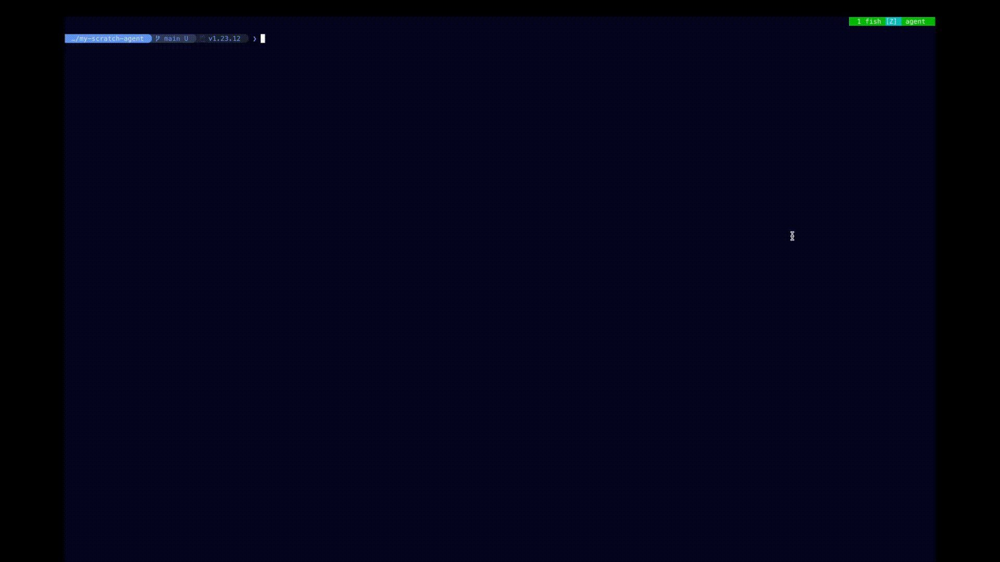

# my-scratch-agent

Go で実装した学習用の AI エージェント。Claude API を使い、ReAct パターンでツールを自律的に呼び出しながらタスクを実行する。



## 動作概要

1. ユーザーが CLI から自然言語でタスクを入力
2. エージェントが LLM（Claude）にリクエストを送信
3. LLM がツール使用を要求した場合、対応するツールを実行し結果を LLM に返す
4. LLM が `end_turn` を返すまでループを繰り返す（最大 10 ステップ）
5. 最終回答をターミナルに出力

## セットアップ

```bash
export ANTHROPIC_API_KEY=your_api_key_here
go run .
```

`.env` ファイルを使う場合は自前でロードするか、`direnv` 等を利用してください。

## 使い方

```
> このディレクトリの Go ファイルを一覧して
> main.go の内容を読んで要約して
> exit
```

`exit` または `quit` で終了、`Ctrl+D` でも終了できます。

## アーキテクチャ

```
.
├── main.go              - エントリポイント、REPL ループ
├── agent.go             - ReAct エージェントループ
├── domain/              - LLMClient / Memory / ブロック型のインターフェース定義
├── adapter/anthropic/   - Claude API クライアント実装
├── memory/              - インメモリ会話履歴
├── tools/               - Tool インターフェース + 各ツール実装
│   ├── read_file.go
│   └── bash.go
└── docs/                - 設計ドキュメント
```

### ツール

| ツール名    | 説明                       |
| ----------- | -------------------------- |
| `read_file` | 指定パスのファイルを読む   |
| `bash`      | シェルコマンドを実行する   |

## 設計方針

- `LLMClient` と `Memory` はインターフェースで抽象化しており、差し替え可能
- ツールは `Tool` インターフェースを実装すれば `NewAgent` に渡すだけで追加できる
- 会話履歴はプロセス起動中のみ保持（インメモリ）

詳細は `docs/design.md` を参照。

## 依存

- Go 1.23+
- [anthropic-sdk-go](https://github.com/anthropics/anthropic-sdk-go)
